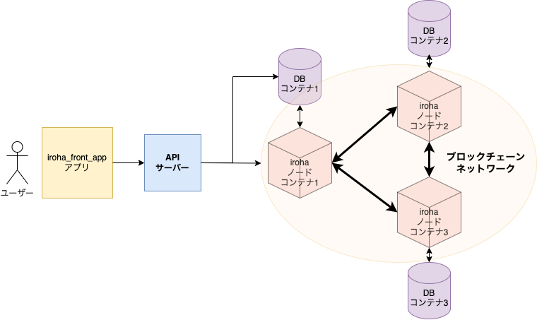

# iroha
Hyperledger Irohaを学習するためのリポジトリです。  

## iroha_front_appの簡易システム構成図
   Hyperledger Irohaを利用して構築したサンプルアプリケーションの概要図は下記の通り。  
   クライアントアプリは、TypeScript+React.js  
   APIサーバーは、Express  
   DBコンテナは、Postgresqlのイメージファイル  
   Irohaノードコンテナは、Hyperledger Irohaのイメージファイルを利用しています。
     

## 注意事項1
   この中で利用している公開鍵及び秘密鍵の情報は全て開発用として生成しています。  
   絶対に本番環境では利用しないようにしてください。

## 注意事項2
   iroha_front_appでは、Reactとサーバー用に設定ファイルを必要とします。
   iroha_front_appのフォルダ直下に「.env」ファイルを  
   iroha_front_app/configフォルダに「local.yaml」ファイルを作成してください。

### .envの設定例 
    REACT_APP_API_SERVER_URL=http://localhost:3001

### local.yamlの設定例
      config:  
      db: 'localhost'  
      iroha_node: 'localhost'  
      local_key_dir: '/{gitフォルダまでのパス}/git/iroha/example/'  
      dev_key_dir: '/{gitフォルダまでのパス}/git/iroha/example/'  
   
## Hyperledger Iroha
   hyperledgerプロジェクトで4番目に採択されたブロックチェーン  
   オリジナルコードについては、ソラミツ株式会社が開発した。  
   ターミナルからの操作についてはコマンドでの操作となるが、  
   対話式のインターフェースなのでとても操作しやすい。

## Hyperledger Irohaの基本的な概念

   1. ドメイン  
       グループ化や区分けを実現するための抽象化する概念のこと
   2. アセット  
       アカウントが取引や蓄積を行う資産の種類のこと  
       Hyperledger Iroha上では複数のアセットを取り扱うことが可能
   3. アカウント  
       アセットをやりとりすることができる。  
       アカウントIDは、「アカウント名@ドメイン」と表現される。

## 権限とロール
   Hyperledger Irohaには、53もの権限が存在し、大きく命令タイプと  
   問い合わせタイプに分類できる。  
   また、権限設定をまとめたものがロールとなる。

## World State View
   PostgreaSQLのDB内に格納されるブロックチェーン外で保持しなければならない情報のこと。  
   16個の表が存在し、Hyperledger Irohaで構成されるブロックチェーンの最新の情報を  
   保持する。

## World State Viewを構成するDBの構成

| テーブル名                        | 役割                                           | 
| --------------------------------- | ---------------------------------------------- | 
| account                           | アカウントを管理する。                         | 
| account_has_asset                 | アカウント毎のアセット別の残高を管理する。     | 
| account_has_grantable_premissions | アカウントに対して付与した権限を管理する。     | 
| account_has_roles                 | アカウント毎に設定されたロールを管理する。     | 
| account_has_signatory             | アカウント毎の公開鍵を管理する。               | 
| asset                             | アセットを管理する。                           | 
| domain                            | ドメインを管理する。                           | 
| height_by_account_set             | ブロック別に関連するアカウントを管理する。     | 
| index_by_creator_height           | ブロックを作成したアカウントを連番で管理する。 | 
| peer                              | Peerの情報を管理する。                         | 
| position_by_account_asset         | アセットの転送を管理する。                     | 
| position_by_hash                  | ブロック毎のハッシュ値を管理する。             | 
| role                              | ロールを管理する。                             | 
| role_has_permissions              | ロール毎の権利を管理する。                     | 
| signatory                         | 公開鍵を管理する。                             | 
| tx_status_by_hash                 | トランザクションの成功/失敗を記録する。        | 

## Hyperledger Irohaのジェネシスブロック構造の例

~~~

{
   "blockV1":{
      "payload":{
         "transactions":[{
            "payload":{
               "reducedPayload":{
                  "commands":[{
                     "addPeer":{
                        "peer":{
                           "address":"127.0.0.1:10001","peerKey":"bddd58404d1315e0eb27902c5d7c8eb0602c16238f005773df406bc191308929"
                        }}
                     },{
                        "createRole":{
                           "roleName":"admin",
                           "permissions":
                              [
                                 "can_add_peer",
                                 "can_add_signatory",
                                 "can_create_account",
                                 "can_create_domain",
                                 "can_get_all_acc_ast",
                                 "can_get_all_acc_ast_txs",
                                 "can_get_all_acc_detail",
                                 "can_get_all_acc_txs",
                                 "can_get_all_accounts",
                                 "can_get_all_signatories",
                                 "can_get_all_txs",
                                 "can_get_blocks",
                                 "can_get_roles",
                                 "can_read_assets",
                                 "can_remove_signatory",
                                 "can_set_quorum"
                              ]
                        }
                     },{
                        "createRole":{
                           "roleName":"user",
                           "permissions":
                              [
                                 "can_add_signatory",
                                 "can_get_my_acc_ast",
                                 "can_get_my_acc_ast_txs",
                                 "can_get_my_acc_detail",
                                 "can_get_my_acc_txs",
                                 "can_get_my_account",
                                 "can_get_my_signatories",
                                 "can_get_my_txs",
                                 "can_grant_can_add_my_signatory",
                                 "can_grant_can_remove_my_signatory",
                                 "can_grant_can_set_my_account_detail",
                                 "can_grant_can_set_my_quorum",
                                 "can_grant_can_transfer_my_assets",
                                 "can_receive",
                                 "can_remove_signatory",
                                 "can_set_quorum",
                                 "can_transfer"
                              ]
                        }
                     },{
                        "createRole":{
                        "roleName":"money_creator",
                        "permissions":
                           [
                              "can_add_asset_qty",
                              "can_create_asset",
                              "can_receive",
                              "can_transfer"
                           ]
                        }
                     },{
                        "createDomain":{
                           "domainId":"test",
                           "defaultRole":"user"
                        }
                     },{
                        "createAsset":{
                           "assetName":"coin",
                           "domainId":"test",
                           "precision":2
                        }
                     },{
                        "createAccount":{
                           "accountName":"admin",
                           "domainId":"test","publicKey":"313a07e6384776ed95447710d15e59148473ccfc052a681317a72a69f2a49910"
                        }
                     },{
                        "createAccount":{
                           "accountName":"test",
                           "domainId":"test","publicKey":"716fe505f69f18511a1b083915aa9ff73ef36e6688199f3959750db38b8f4bfc"
                        }
                     },{
                        "appendRole":{
                           "accountId":"admin@test",
                           "roleName":"admin"
                        }
                     },{
                        "appendRole":{
                           "accountId":"admin@test",
                           "roleName":"money_creator"
                        }
                     }],
                     "quorum":1
                  }
               }
            }
         ],
         "txNumber":1,
         "height":"1",
         "prevBlockHash":"0000000000000000000000000000000000000000000000000000000000000000"
      }
   }
}

~~~

## 生成されるブロックの例

~~~

blockV1: {
    payload: {
      transactionsList: [
        {
          payload: {
            reducedPayload: {
              commandsList: [
                {
                  addAssetQuantity: { assetId: 'ticket#nihon', amount: '30' },
                  addPeer: undefined,
                  addSignatory: undefined,
                  appendRole: undefined,
                  createAccount: undefined,
                  createAsset: undefined,
                  createDomain: undefined,
                  createRole: undefined,
                  detachRole: undefined,
                  grantPermission: undefined,
                  removeSignatory: undefined,
                  revokePermission: undefined,
                  setAccountDetail: undefined,
                  setAccountQuorum: undefined,
                  subtractAssetQuantity: undefined,
                  transferAsset: undefined
                }
              ],
              creatorAccountId: 'test110@nihon',
              createdTime: 1642920874175,
              quorum: 1
            },
            batch: undefined
          },
          signaturesList: [
            {
              publicKey: 'c1a60da19955d66b6c183fb601f3a702c746234ac44818ac9b89d5029a0b73be',
              signature: 'fc45206695431b7d6dfe6a84dfc8808a8f1fde8e6b7e6fc79b11e10286b93858622eb837aa8d0d4142899c3210af5e8e4f24abee518c38e4340a23af7ae51603'
            }
          ]
        },
        {
          payload: {
            reducedPayload: {
              commandsList: [
                {
                  addAssetQuantity: { assetId: 'total#nihon', amount: '150000' },
                  addPeer: undefined,
                  addSignatory: undefined,
                  appendRole: undefined,
                  createAccount: undefined,
                  createAsset: undefined,
                  createDomain: undefined,
                  createRole: undefined,
                  detachRole: undefined,
                  grantPermission: undefined,
                  removeSignatory: undefined,
                  revokePermission: undefined,
                  setAccountDetail: undefined,
                  setAccountQuorum: undefined,
                  subtractAssetQuantity: undefined,
                  transferAsset: undefined
                }
              ],
              creatorAccountId: 'test110@nihon',
              createdTime: 1642920874178,
              quorum: 1
            },
            batch: undefined
          },
          signaturesList: [
            {
              publicKey: 'c1a60da19955d66b6c183fb601f3a702c746234ac44818ac9b89d5029a0b73be',
              signature: 'da325146363da11d8bd8fe268f1d4f29834a7797e00a213c799e7fcda0b7e942fa6048c91357fb7c66380a41b0c30d4e737bc7173a91c39243f409965163b301'
            }
          ]
        },
        {
          payload: {
            reducedPayload: {
              commandsList: [
                {
                  addAssetQuantity: { assetId: 'prepay#nihon', amount: '5000' },
                  addPeer: undefined,
                  addSignatory: undefined,
                  appendRole: undefined,
                  createAccount: undefined,
                  createAsset: undefined,
                  createDomain: undefined,
                  createRole: undefined,
                  detachRole: undefined,
                  grantPermission: undefined,
                  removeSignatory: undefined,
                  revokePermission: undefined,
                  setAccountDetail: undefined,
                  setAccountQuorum: undefined,
                  subtractAssetQuantity: undefined,
                  transferAsset: undefined
                }
              ],
              creatorAccountId: 'test110@nihon',
              createdTime: 1642920874142,
              quorum: 1
            },
            batch: undefined
          },
          signaturesList: [
            {
              publicKey: 'c1a60da19955d66b6c183fb601f3a702c746234ac44818ac9b89d5029a0b73be',
              signature: '21c2712e3c7670e8e65016130044d8da99e042574beacc8581cb93776168dd1b9a3e0357e427370e4471a393860b75926f41bd0ff416de22c7d0c0bcf7d1bb06'
            }
          ]
        }
      ],
      txNumber: 0,
      height: 19,
      prevBlockHash: '01ca4a8d5c4b52b39831a01a4a96049991de4bb4231922ec0dcce5ca196dce9b',
      createdTime: 1642920874462,
      rejectedTransactionsHashesList: []
    },
    signaturesList: [
      {
        publicKey: 'bddd58404d1315e0eb27902c5d7c8eb0602c16238f005773df406bc191308929',
        signature: '2c0d74d47a4fc3d41954005e30074286d7516cfcb72290ca4bc53267c1a8e160b0747f88c6dd98f5032dafebb3d79fb13c29d3b17c741ff2c96217b457548b06'
      },
      {
        publicKey: '94cc41678114bfb18c8c3e59c223e303410856bda6e34833bb4e14b2daa803dd',
        signature: 'cfb6a2c2ccb61ab669728b99f1d4c9b50d89f1326e50866f99e37f8b0d826b1e42321fdea5e7e8cde3375da93da341e56ae10cf993e428a1cc7c7419c55b1801'
      },
      {
        publicKey: '4c5a1ff9494101034a37760eaf53bef3828acfda4f61d7e8f6d3f8fb599e03bb',
        signature: '1def05ad11cab2eebe8cc7f828b362096394e731211e327663be1c17523c4279ae300c3cba9f4500badb5c61ccd6bacdc079ca986882f2afba3a8cc2811fb905'
      }
    ]
  }
}

~~~
    
### コンテナへのアクセスコマンド
    docker exec -it iroha /bin/bash
    docker exec -it iroha1 /bin/bash
    docker exec -it iroha2 /bin/bash 
    docker exec -it some-postgres /bin/bash

### DB操作コマンド
    1. スキーマ「iroha_default」でDBにログインする。

   `psql -U postgres iroha_default`  

   `CREATE DATABASE reidai;`  

   `CREATE TABLE kaiin_info (  
      no serial,   
      id VARCHAR(20),   
      name VARCHAR(50),   
      kana VARCHAR(50),  
      addr VARCHAR(100),  
      tel VARCHAR(30),   
      bd VARCHAR(20),  
      ed VARCHAR(20),  
      block bigint,  
      today timestamp DEFAULT now(), 
      password VARCHAR(300), 
      PRIMARY KEY (no));`  

   `CREATE TABLE shiharai_info (
      no serial,   
      id VARCHAR(20),  
      prepay numeric,
      ticket numeric,
      total numeric,
      shisetsu VARCHAR(50),
      ninzu int,
      usetime numeric,
      job VARCHAR(10),
      today timestamp DEFAULT now(),  
      PRIMARY KEY (no));`

   `¥q`  
    
### Dockerホストからコンテナへディレクトリをコピーするコマンド(例)
   `docker cp ~/git/iroha/example/ 601126ae851d:/opt/iroha_data`
    
### irohaプロセス起動コマンド (--genesis_block genesis.blockは初回起動時のみ付与する。)
   `irohad --config config.docker --genesis_block genesis.block --keypair_name node0`   
   `irohad --config config.docker --genesis_block genesis.block --keypair_name node1`  
   `irohad --config config.docker --genesis_block genesis.block --keypair_name node2`  

### 初期化するとき
    -overwrite_ledger true をつけること！
### iroha-cliの起動コマンド(admin@test.pubファイルが存在するディレクトリで打ちこむ)
   `iroha-cli -account_name admin@test`  

### コンテナ削除コマンド
   `docker rm iroha iroha1 iroha2 some-postgres some-postgres1 somepostgre2`  

### コンテナ起動＆停止コマンド
   `docker start iroha iroha1 iroha2 some-postgres some-postgres1 somepostgre2`  
   `docker stop iroha iroha1 iroha2 some-postgres some-postgres1 somepostgre2`

### ボリューム作成コマンド
   `docker volume create blockstore`  

### docker-compose起動コマンド(irohaコンテナとpostgresコンテナがそれぞれ3つ立ち上がる。)
   `docker-compose up -d`

### サンプルフロントエンド用アプリケーション実行コマンド
   1. `cd iroha_front_app`  
   2. `npm run build`
   3. `node server.js`

### iroha_front_appについて
    TypeScript + React + express により構築。  

### server.jsについて
    expressを利用して構築したWebサーバー  
    各種必要なAPIを定義している。
    
### superAgentを使用する際の注意点
    superAgentは、JavaScriptのライブラリなので直接読み込もうとすると  
    怒られる。そのため次のコマンドを打ち込んで翻訳する必要あり  
    npm install @types/superagent   
    ※その他のモジュールについても必要に応じて@typesをつけてインストールする必要あり。
   
### DBにカラムを追加する時の例
   `ALTER TABLE kaiin_info ADD COLUMN password VARCHAR(300);`

### 参考サイト
   <a href="https://visionmedia.github.io/superagent/">superAgentの公式ページ</a>  
   <a href="https://github.com/hyperledger/iroha-javascript">Hyperledger Irohaのjavascriptライブラリのリポジトリ</a>  
   <a href="https://zenn.dev/msksgm/articles/20211117-typescript-react-router-dom-layout">画面遷移実装サンプル</a>  
   <a href="https://qiita.com/seira/items/fccdf4e73c59c491558d">useContextの解説</a>  